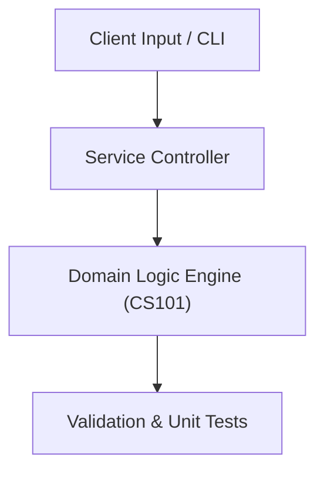

# Project: System Information & Resource Inspector CLI

**Course:** `CS101` Introduction to Computer  
**Demonstrated Concepts:** Computer Hardware & Architecture Fundamentals, Number Systems & Binary Logic, Operating Systems Overview  
**Primary Tech Stack:** CLI, PowerShell, Linux Basics, Hardware Diagnostics  

---

## 📌 Problem Statement
Translating theoretical principles of introduction to computer into a functional, modular software system.

## 🎯 Requirements
1. **Core Functionality**: Execute domain logic for computer hardware & architecture fundamentals and number systems & binary logic.
2. **Modularity & Clean Code**: Adhere to SOLID principles, descriptive naming, and single-responsibility functions.
3. **Verification**: Comprehensive unit test suite verifying standard behavior and edge cases.

## 🏛️ Architecture


## 🚀 Running the Project
```bash
# Execute unit tests
python -m unittest discover tests/
```
