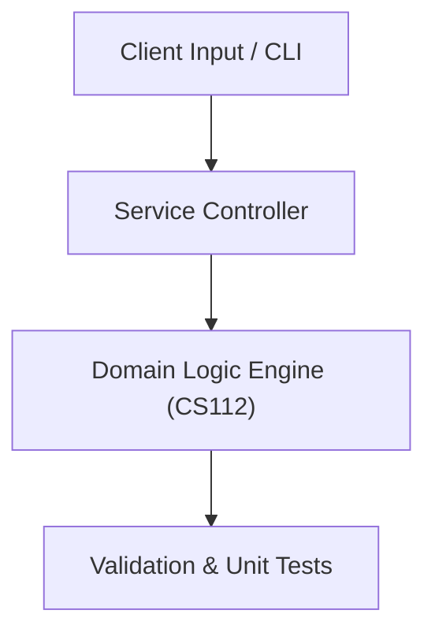

# Project: Credit Card & Financial Transaction Validation Engine

**Course:** `CS112` Java Programming  
**Demonstrated Concepts:** Java Fundamentals & Primitive Types, Control Statements & Loops, Methods & Parameter Passing  
**Primary Tech Stack:** Java 11+, JUnit 5, Maven  

---

## 📌 Problem Statement
Translating theoretical principles of java programming into a functional, modular software system.

## 🎯 Requirements
1. **Core Functionality**: Execute domain logic for java fundamentals & primitive types and control statements & loops.
2. **Modularity & Clean Code**: Adhere to SOLID principles, descriptive naming, and single-responsibility functions.
3. **Verification**: Comprehensive unit test suite verifying standard behavior and edge cases.

## 🏛️ Architecture


## 🚀 Running the Project
```bash
# Execute unit tests
python -m unittest discover tests/
```
