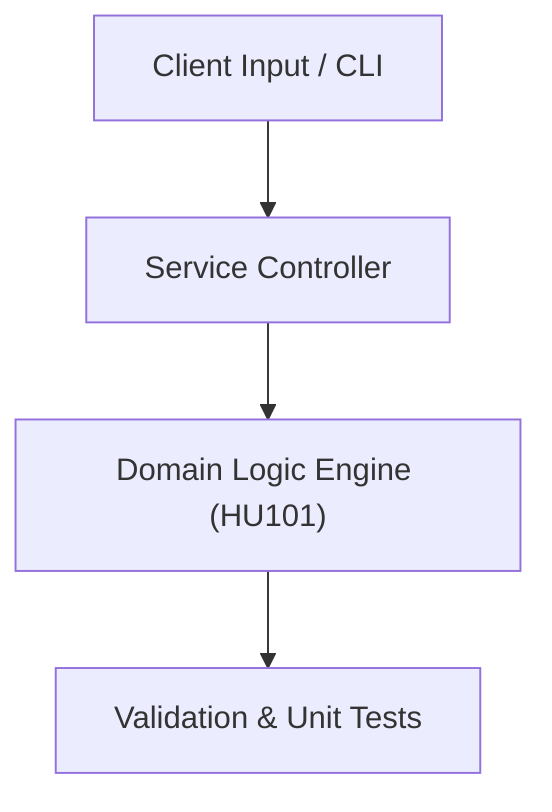

# Project: Technical Documentation & Specification Portfolio

**Course:** `HU101` Technical English 1  
**Demonstrated Concepts:** Technical Vocabulary in Computing, Reading Technical Specifications, Grammar & Sentence Structure for Engineering  
**Primary Tech Stack:** Markdown, LaTeX, Technical Documentation  

---

## 📌 Problem Statement
Translating theoretical principles of technical english 1 into a functional, modular software system.

## 🎯 Requirements
1. **Core Functionality**: Execute domain logic for technical vocabulary in computing and reading technical specifications.
2. **Modularity & Clean Code**: Adhere to SOLID principles, descriptive naming, and single-responsibility functions.
3. **Verification**: Comprehensive unit test suite verifying standard behavior and edge cases.

## 🏛️ Architecture


## 🚀 Running the Project
```bash
# Execute unit tests
python -m unittest discover tests/
```
