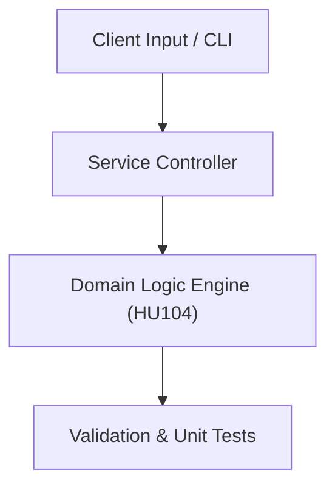

# Project: Engineering Team Organizational & Governance Model

**Course:** `HU104` Principles of Management  
**Demonstrated Concepts:** Management Functions: Planning, Organizing, Leading, Controlling, Organizational Structure & Culture, Strategic Decision Making  
**Primary Tech Stack:** Trello, Agile Management, Gantt Charts  

---

## 📌 Problem Statement
Translating theoretical principles of principles of management into a functional, modular software system.

## 🎯 Requirements
1. **Core Functionality**: Execute domain logic for management functions: planning, organizing, leading, controlling and organizational structure & culture.
2. **Modularity & Clean Code**: Adhere to SOLID principles, descriptive naming, and single-responsibility functions.
3. **Verification**: Comprehensive unit test suite verifying standard behavior and edge cases.

## 🏛️ Architecture


## 🚀 Running the Project
```bash
# Execute unit tests
python -m unittest discover tests/
```
