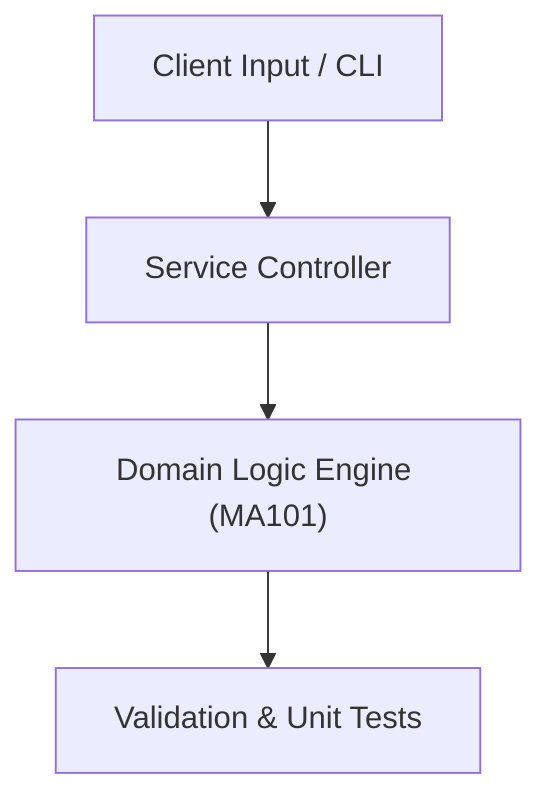

# Project: Numerical Differentiation & Integration Engine

**Course:** `MA101` Mathematics 1  
**Demonstrated Concepts:** Functions, Limits & Continuity, Differential Calculus & Derivatives, Applications of Derivatives (Optimization, Curve Sketching)  
**Primary Tech Stack:** Python, SymPy, NumPy, Matplotlib  

---

## 📌 Problem Statement
Translating theoretical principles of mathematics 1 into a functional, modular software system.

## 🎯 Requirements
1. **Core Functionality**: Execute domain logic for functions, limits & continuity and differential calculus & derivatives.
2. **Modularity & Clean Code**: Adhere to SOLID principles, descriptive naming, and single-responsibility functions.
3. **Verification**: Comprehensive unit test suite verifying standard behavior and edge cases.

## 🏛️ Architecture


## 🚀 Running the Project
```bash
# Execute unit tests
python -m unittest discover tests/
```
