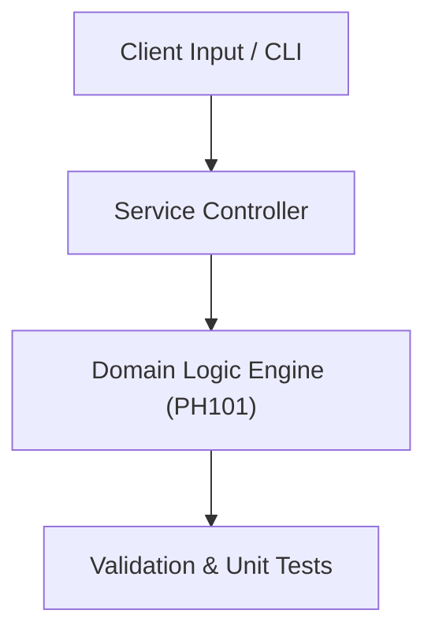

# Project: Electric Field & DC Circuit Numerical Simulator

**Course:** `PH101` General Physics  
**Demonstrated Concepts:** Electric Charges & Coulomb's Law, Electric Fields & Gauss's Law, Electric Potential & Capacitance  
**Primary Tech Stack:** Python, SciPy, Circuit Simulators  

---

## 📌 Problem Statement
Translating theoretical principles of general physics into a functional, modular software system.

## 🎯 Requirements
1. **Core Functionality**: Execute domain logic for electric charges & coulomb's law and electric fields & gauss's law.
2. **Modularity & Clean Code**: Adhere to SOLID principles, descriptive naming, and single-responsibility functions.
3. **Verification**: Comprehensive unit test suite verifying standard behavior and edge cases.

## 🏛️ Architecture


## 🚀 Running the Project
```bash
# Execute unit tests
python -m unittest discover tests/
```
