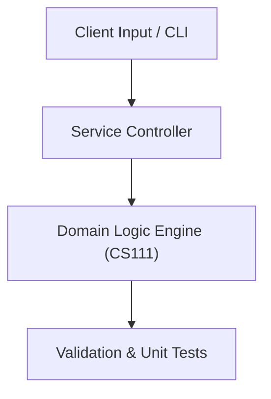

# Project: Personal Expense Tracker & Financial CLI

**Course:** `CS111` Programming Language 1 (C++)  
**Demonstrated Concepts:** C++ Syntax & Compilers, Control Structures & Loops, Functions & Scope  
**Primary Tech Stack:** C++17, GCC / Clang, Make / CMake  

---

## 📌 Problem Statement
Translating theoretical principles of programming language 1 (c++) into a functional, modular software system.

## 🎯 Requirements
1. **Core Functionality**: Execute domain logic for c++ syntax & compilers and control structures & loops.
2. **Modularity & Clean Code**: Adhere to SOLID principles, descriptive naming, and single-responsibility functions.
3. **Verification**: Comprehensive unit test suite verifying standard behavior and edge cases.

## 🏛️ Architecture


## 🚀 Running the Project
```bash
# Execute unit tests
python -m unittest discover tests/
```
