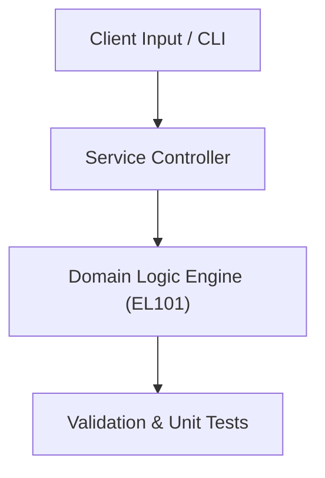

# Project: Analog Circuit & Logic Gate Analysis Simulator

**Course:** `EL101` Computer Electronics  
**Demonstrated Concepts:** Semiconductor Physics & PN Junction Diodes, Diode Applications (Rectifiers, Clippers, Clampers), Bipolar Junction Transistors (BJT)  
**Primary Tech Stack:** SPICE, Proteus, Python  

---

## 📌 Problem Statement
Translating theoretical principles of computer electronics into a functional, modular software system.

## 🎯 Requirements
1. **Core Functionality**: Execute domain logic for semiconductor physics & pn junction diodes and diode applications (rectifiers, clippers, clampers).
2. **Modularity & Clean Code**: Adhere to SOLID principles, descriptive naming, and single-responsibility functions.
3. **Verification**: Comprehensive unit test suite verifying standard behavior and edge cases.

## 🏛️ Architecture


## 🚀 Running the Project
```bash
# Execute unit tests
python -m unittest discover tests/
```
