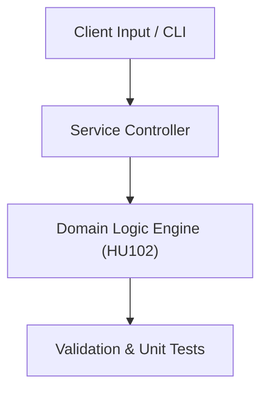

# Project: Software Engineering Whitepaper & Specification Review

**Course:** `HU102` Technical English 2  
**Demonstrated Concepts:** Engineering Proposals & Whitepapers, Writing Technical Reports, Cross-Cultural Communication  
**Primary Tech Stack:** Markdown, Pandoc, Grammarly  

---

## 📌 Problem Statement
Translating theoretical principles of technical english 2 into a functional, modular software system.

## 🎯 Requirements
1. **Core Functionality**: Execute domain logic for engineering proposals & whitepapers and writing technical reports.
2. **Modularity & Clean Code**: Adhere to SOLID principles, descriptive naming, and single-responsibility functions.
3. **Verification**: Comprehensive unit test suite verifying standard behavior and edge cases.

## 🏛️ Architecture


## 🚀 Running the Project
```bash
# Execute unit tests
python -m unittest discover tests/
```
