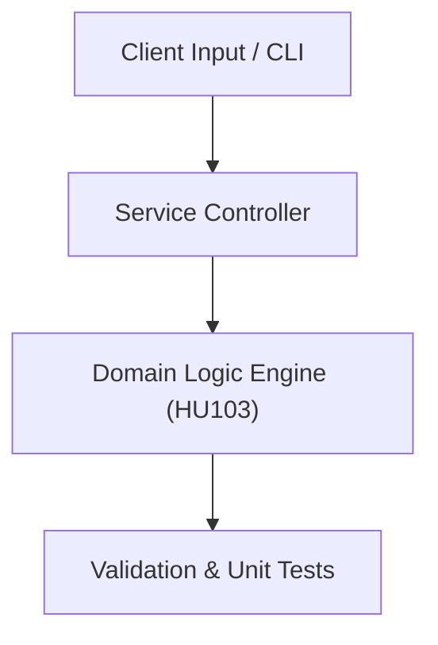

# Project: Market Equilibrium & SaaS Pricing Optimization Engine

**Course:** `HU103` Principles of Economics  
**Demonstrated Concepts:** Supply, Demand & Market Equilibrium, Elasticity of Demand & Supply, Consumer Choice Theory & Utility  
**Primary Tech Stack:** Python, Pandas, Matplotlib  

---

## 📌 Problem Statement
Translating theoretical principles of principles of economics into a functional, modular software system.

## 🎯 Requirements
1. **Core Functionality**: Execute domain logic for supply, demand & market equilibrium and elasticity of demand & supply.
2. **Modularity & Clean Code**: Adhere to SOLID principles, descriptive naming, and single-responsibility functions.
3. **Verification**: Comprehensive unit test suite verifying standard behavior and edge cases.

## 🏛️ Architecture


## 🚀 Running the Project
```bash
# Execute unit tests
python -m unittest discover tests/
```
