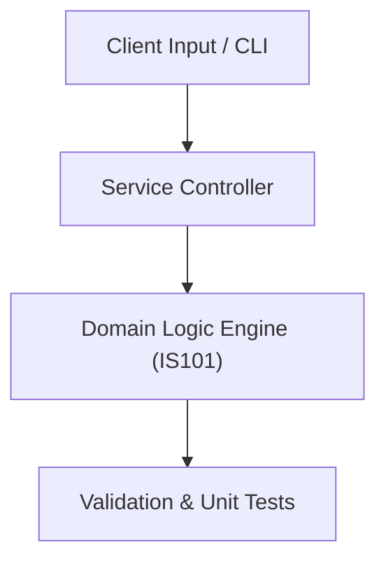

# Project: Enterprise Information Architecture Blueprint

**Course:** `IS101` Information Systems Fundamentals  
**Demonstrated Concepts:** Role of Information Systems in Business, Hardware & Software Infrastructure, Data Management & Business Intelligence  
**Primary Tech Stack:** UML, BPMN, Entity Relationship Diagrams  

---

## 📌 Problem Statement
Translating theoretical principles of information systems fundamentals into a functional, modular software system.

## 🎯 Requirements
1. **Core Functionality**: Execute domain logic for role of information systems in business and hardware & software infrastructure.
2. **Modularity & Clean Code**: Adhere to SOLID principles, descriptive naming, and single-responsibility functions.
3. **Verification**: Comprehensive unit test suite verifying standard behavior and edge cases.

## 🏛️ Architecture


## 🚀 Running the Project
```bash
# Execute unit tests
python -m unittest discover tests/
```
