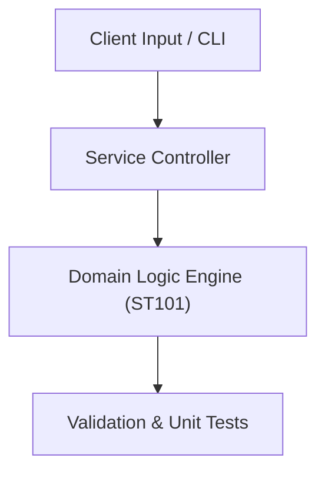

# Project: Statistical Distribution & Hypothesis Testing Analyzer

**Course:** `ST101` Probability & Statistics  
**Demonstrated Concepts:** Descriptive Statistics & Data Visualization, Probability Concepts & Bayes' Theorem, Discrete Distributions (Binomial, Poisson, Geometric)  
**Primary Tech Stack:** Python, SciPy, Statsmodels, Seaborn  

---

## 📌 Problem Statement
Translating theoretical principles of probability & statistics into a functional, modular software system.

## 🎯 Requirements
1. **Core Functionality**: Execute domain logic for descriptive statistics & data visualization and probability concepts & bayes' theorem.
2. **Modularity & Clean Code**: Adhere to SOLID principles, descriptive naming, and single-responsibility functions.
3. **Verification**: Comprehensive unit test suite verifying standard behavior and edge cases.

## 🏛️ Architecture


## 🚀 Running the Project
```bash
# Execute unit tests
python -m unittest discover tests/
```
