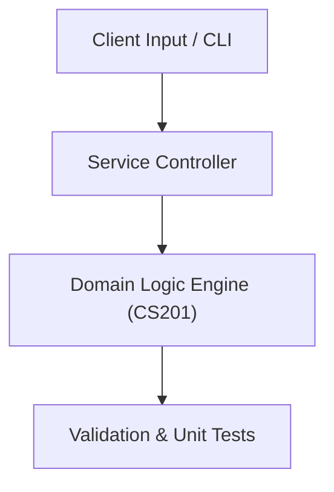

# Project: Propositional Logic Solver & Graph Relations Engine

**Course:** `CS201` Discrete Structures  
**Demonstrated Concepts:** Propositional & Predicate Logic, Sets, Functions, Sequences & Summations, Methods of Proof & Mathematical Induction  
**Primary Tech Stack:** Python, NetworkX, Truth Table Engine  

---

## 📌 Problem Statement
Translating theoretical principles of discrete structures into a functional, modular software system.

## 🎯 Requirements
1. **Core Functionality**: Execute domain logic for propositional & predicate logic and sets, functions, sequences & summations.
2. **Modularity & Clean Code**: Adhere to SOLID principles, descriptive naming, and single-responsibility functions.
3. **Verification**: Comprehensive unit test suite verifying standard behavior and edge cases.

## 🏛️ Architecture


## 🚀 Running the Project
```bash
# Execute unit tests
python -m unittest discover tests/
```
