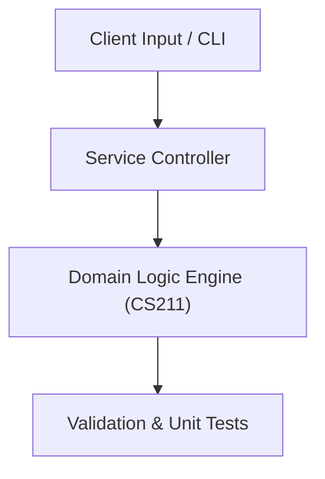

# Project: High-Performance Task Management & Priority Queue Engine

**Course:** `CS211` Data Structures  
**Demonstrated Concepts:** Abstract Data Types & Big-O Complexity, Singly & Doubly Linked Lists, Stacks & Queues (Array & Linked Implementations)  
**Primary Tech Stack:** C++17, Java, Google Test / Catch2  

---

## 📌 Problem Statement
Translating theoretical principles of data structures into a functional, modular software system.

## 🎯 Requirements
1. **Core Functionality**: Execute domain logic for abstract data types & big-o complexity and singly & doubly linked lists.
2. **Modularity & Clean Code**: Adhere to SOLID principles, descriptive naming, and single-responsibility functions.
3. **Verification**: Comprehensive unit test suite verifying standard behavior and edge cases.

## 🏛️ Architecture


## 🚀 Running the Project
```bash
# Execute unit tests
python -m unittest discover tests/
```
