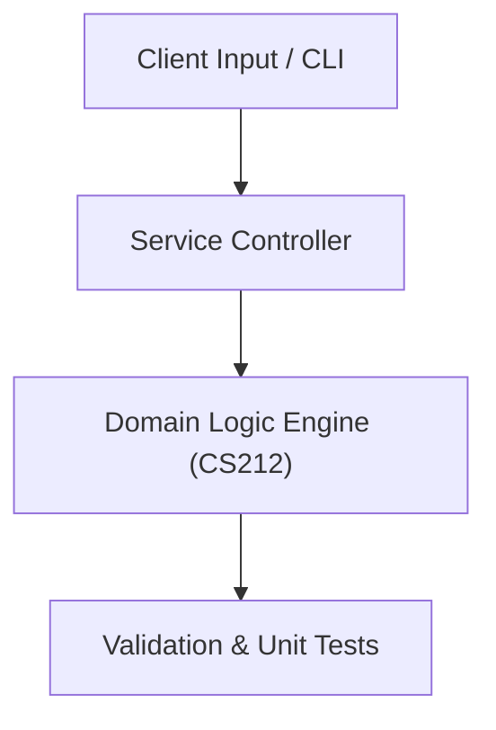

# Project: Object-Oriented University Library Management System

**Course:** `CS212` Programming Language 2 (OOP)  
**Demonstrated Concepts:** Classes, Objects, Constructors & Destructors, Operator Overloading & Friend Functions, Inheritance Hierarchies & Multiple Inheritance  
**Primary Tech Stack:** C++17, UML, Valgrind  

---

## 📌 Problem Statement
Translating theoretical principles of programming language 2 (oop) into a functional, modular software system.

## 🎯 Requirements
1. **Core Functionality**: Execute domain logic for classes, objects, constructors & destructors and operator overloading & friend functions.
2. **Modularity & Clean Code**: Adhere to SOLID principles, descriptive naming, and single-responsibility functions.
3. **Verification**: Comprehensive unit test suite verifying standard behavior and edge cases.

## 🏛️ Architecture


## 🚀 Running the Project
```bash
# Execute unit tests
python -m unittest discover tests/
```
