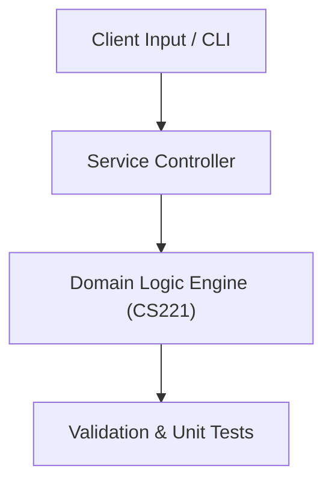

# Project: 4-Bit Arithmetic Logic Unit & FSM Digital Simulator

**Course:** `CS221` Digital Logic Design  
**Demonstrated Concepts:** Boolean Algebra & Logic Simplification (K-Maps), Combinational Logic Design (Adders, Multiplexers, Decoders), Arithmetic Logic Unit (ALU) Architecture  
**Primary Tech Stack:** Verilog, Logisim, Digital Simulator  

---

## 📌 Problem Statement
Translating theoretical principles of digital logic design into a functional, modular software system.

## 🎯 Requirements
1. **Core Functionality**: Execute domain logic for boolean algebra & logic simplification (k-maps) and combinational logic design (adders, multiplexers, decoders).
2. **Modularity & Clean Code**: Adhere to SOLID principles, descriptive naming, and single-responsibility functions.
3. **Verification**: Comprehensive unit test suite verifying standard behavior and edge cases.

## 🏛️ Architecture


## 🚀 Running the Project
```bash
# Execute unit tests
python -m unittest discover tests/
```
