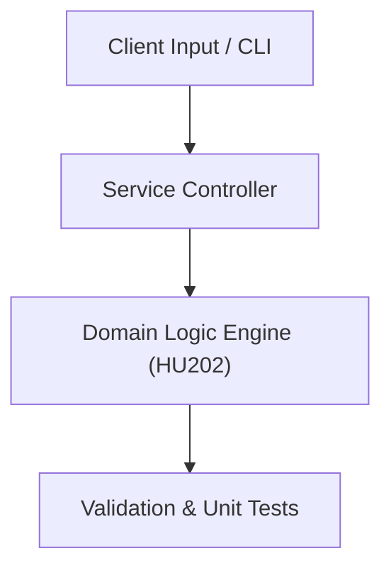

# Project: Software Licensing & Data Privacy Compliance Auditor

**Course:** `HU202` Business Law & Ethics  
**Demonstrated Concepts:** Introduction to Legal Systems & Contract Law, Intellectual Property & Open Source Licenses (GPL, MIT, Apache), Cybercrime, Data Privacy & GDPR Regulations  
**Primary Tech Stack:** License Auditing, Compliance Checklists, GDPR Toolkits  

---

## 📌 Problem Statement
Translating theoretical principles of business law & ethics into a functional, modular software system.

## 🎯 Requirements
1. **Core Functionality**: Execute domain logic for introduction to legal systems & contract law and intellectual property & open source licenses (gpl, mit, apache).
2. **Modularity & Clean Code**: Adhere to SOLID principles, descriptive naming, and single-responsibility functions.
3. **Verification**: Comprehensive unit test suite verifying standard behavior and edge cases.

## 🏛️ Architecture


## 🚀 Running the Project
```bash
# Execute unit tests
python -m unittest discover tests/
```
