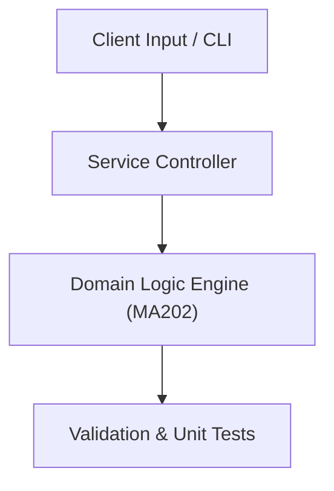

# Project: Linear Algebra Matrix Operations & Decomposition Library

**Course:** `MA202` Mathematics 2  
**Demonstrated Concepts:** Systems of Linear Equations & Gaussian Elimination, Matrix Algebra, Inverses & Determinants, Vector Spaces, Subspaces & Basis  
**Primary Tech Stack:** Python, NumPy, SciPy  

---

## 📌 Problem Statement
Translating theoretical principles of mathematics 2 into a functional, modular software system.

## 🎯 Requirements
1. **Core Functionality**: Execute domain logic for systems of linear equations & gaussian elimination and matrix algebra, inverses & determinants.
2. **Modularity & Clean Code**: Adhere to SOLID principles, descriptive naming, and single-responsibility functions.
3. **Verification**: Comprehensive unit test suite verifying standard behavior and edge cases.

## 🏛️ Architecture


## 🚀 Running the Project
```bash
# Execute unit tests
python -m unittest discover tests/
```
