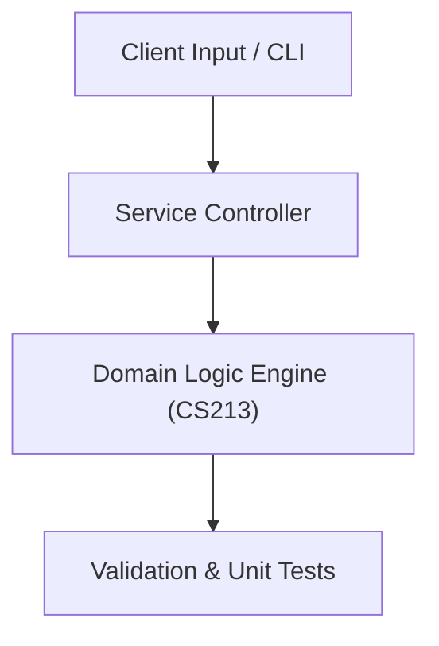

# Project: Route Optimization & Graph Algorithm Visualizer Engine

**Course:** `CS213` Design & Analysis of Algorithms  
**Demonstrated Concepts:** Asymptotic Analysis & Recurrence Relations (Master Theorem), Divide and Conquer (Merge Sort, Quick Sort, Binary Search), Greedy Algorithms (Huffman Coding, Kruskal, Prim)  
**Primary Tech Stack:** C++17, Python, Benchmarking Tools  

---

## 📌 Problem Statement
Translating theoretical principles of design & analysis of algorithms into a functional, modular software system.

## 🎯 Requirements
1. **Core Functionality**: Execute domain logic for asymptotic analysis & recurrence relations (master theorem) and divide and conquer (merge sort, quick sort, binary search).
2. **Modularity & Clean Code**: Adhere to SOLID principles, descriptive naming, and single-responsibility functions.
3. **Verification**: Comprehensive unit test suite verifying standard behavior and edge cases.

## 🏛️ Architecture


## 🚀 Running the Project
```bash
# Execute unit tests
python -m unittest discover tests/
```
