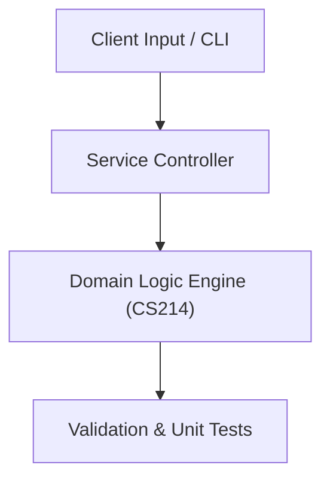

# Project: Desktop University Student & Grade Management System

**Course:** `CS214` Visual Programming (C#)  
**Demonstrated Concepts:** .NET Framework & CLR Architecture, C# Language Syntax, Properties & Delegates, Windows Forms & GUI Event-Driven Programming  
**Primary Tech Stack:** C#, .NET Core / .NET 6+, Windows Forms / WPF  

---

## 📌 Problem Statement
Translating theoretical principles of visual programming (c#) into a functional, modular software system.

## 🎯 Requirements
1. **Core Functionality**: Execute domain logic for .net framework & clr architecture and c# language syntax, properties & delegates.
2. **Modularity & Clean Code**: Adhere to SOLID principles, descriptive naming, and single-responsibility functions.
3. **Verification**: Comprehensive unit test suite verifying standard behavior and edge cases.

## 🏛️ Architecture


## 🚀 Running the Project
```bash
# Execute unit tests
python -m unittest discover tests/
```
