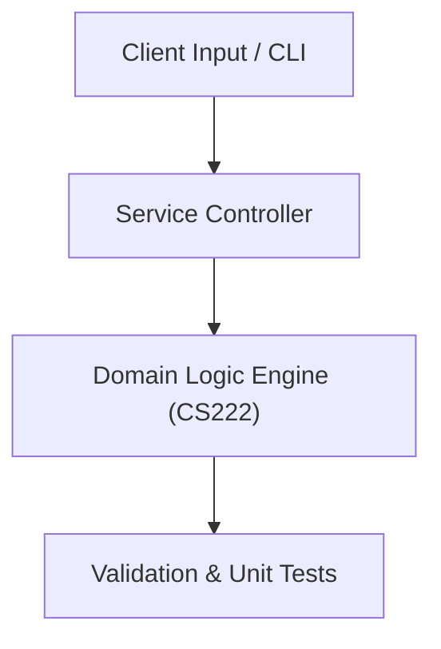

# Project: MIPS Instruction Set CPU Emulator & Cache Simulator

**Course:** `CS222` Computer Architecture & Organization  
**Demonstrated Concepts:** Instruction Set Architecture (ISA) & MIPS Assembly, Processor Datapath & Control Units, Pipelining & Pipeline Hazards (Data, Control, Structural)  
**Primary Tech Stack:** MIPS Assembly, MARS Simulator, C++  

---

## 📌 Problem Statement
Translating theoretical principles of computer architecture & organization into a functional, modular software system.

## 🎯 Requirements
1. **Core Functionality**: Execute domain logic for instruction set architecture (isa) & mips assembly and processor datapath & control units.
2. **Modularity & Clean Code**: Adhere to SOLID principles, descriptive naming, and single-responsibility functions.
3. **Verification**: Comprehensive unit test suite verifying standard behavior and edge cases.

## 🏛️ Architecture


## 🚀 Running the Project
```bash
# Execute unit tests
python -m unittest discover tests/
```
