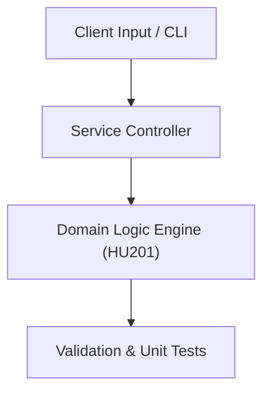

# Project: Double-Entry Ledger & Financial Statement Generator

**Course:** `HU201` Principles of Accounting  
**Demonstrated Concepts:** Accounting Equation & Double-Entry Bookkeeping, Journal Entries, General Ledger & Trial Balance, Financial Statements: Balance Sheet, Income Statement, Cash Flow  
**Primary Tech Stack:** Python, SQL, Excel / Sheets  

---

## 📌 Problem Statement
Translating theoretical principles of principles of accounting into a functional, modular software system.

## 🎯 Requirements
1. **Core Functionality**: Execute domain logic for accounting equation & double-entry bookkeeping and journal entries, general ledger & trial balance.
2. **Modularity & Clean Code**: Adhere to SOLID principles, descriptive naming, and single-responsibility functions.
3. **Verification**: Comprehensive unit test suite verifying standard behavior and edge cases.

## 🏛️ Architecture


## 🚀 Running the Project
```bash
# Execute unit tests
python -m unittest discover tests/
```
