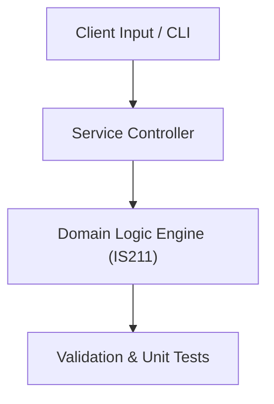

# Project: University Academic Management Relational Database

**Course:** `IS211` Database Systems 1  
**Demonstrated Concepts:** Database Concepts & DBMS Architecture, Entity-Relationship (ER) & Enhanced ER Modeling, Relational Model & Relational Algebra  
**Primary Tech Stack:** PostgreSQL, MySQL, SQL, DBeaver  

---

## 📌 Problem Statement
Translating theoretical principles of database systems 1 into a functional, modular software system.

## 🎯 Requirements
1. **Core Functionality**: Execute domain logic for database concepts & dbms architecture and entity-relationship (er) & enhanced er modeling.
2. **Modularity & Clean Code**: Adhere to SOLID principles, descriptive naming, and single-responsibility functions.
3. **Verification**: Comprehensive unit test suite verifying standard behavior and edge cases.

## 🏛️ Architecture


## 🚀 Running the Project
```bash
# Execute unit tests
python -m unittest discover tests/
```
