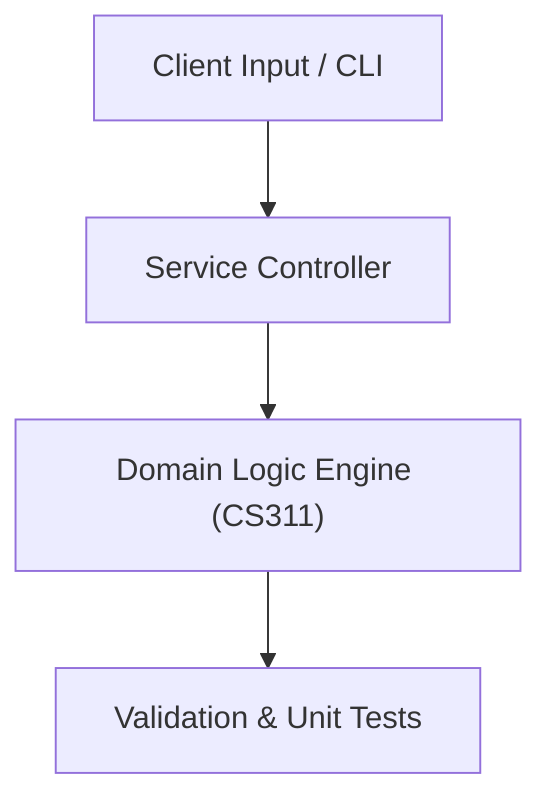

# Project: Finite State Automata & Regular Expression Engine

**Course:** `CS311` Automata & Formal Languages  
**Demonstrated Concepts:** Deterministic Finite Automata (DFA) & NFA, Regular Expressions & Regular Languages, Pumping Lemma for Regular Languages  
**Primary Tech Stack:** Python, JFLAP, Automata Simulators  

---

## 📌 Problem Statement
Translating theoretical principles of automata & formal languages into a functional, modular software system.

## 🎯 Requirements
1. **Core Functionality**: Execute domain logic for deterministic finite automata (dfa) & nfa and regular expressions & regular languages.
2. **Modularity & Clean Code**: Adhere to SOLID principles, descriptive naming, and single-responsibility functions.
3. **Verification**: Comprehensive unit test suite verifying standard behavior and edge cases.

## 🏛️ Architecture


## 🚀 Running the Project
```bash
# Execute unit tests
python -m unittest discover tests/
```
