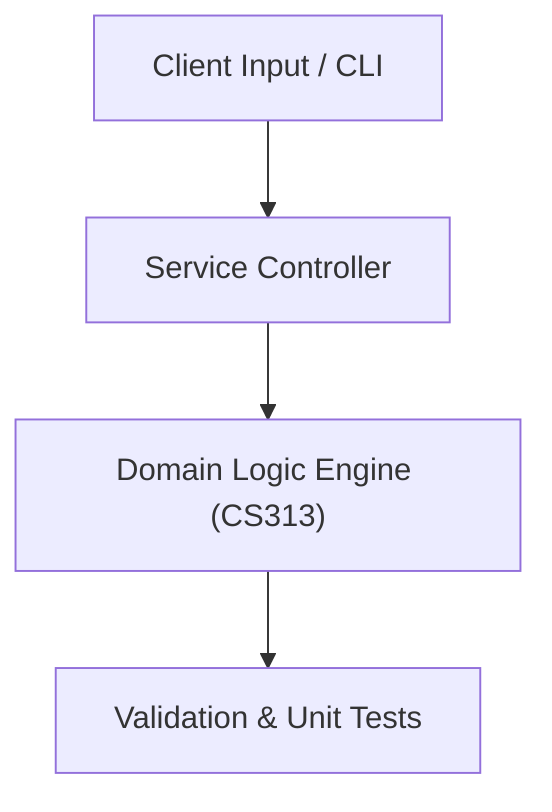

# Project: Interactive Academic Web Portal & Student Dashboard

**Course:** `CS313` Web Programming  
**Demonstrated Concepts:** HTML5 Semantic Structure & Modern Standards, CSS3 Flexbox, Grid & Responsive Layouts, JavaScript DOM Manipulation & Event Handling  
**Primary Tech Stack:** HTML5, CSS3, JavaScript ES6+, Node.js  

---

## 📌 Problem Statement
Translating theoretical principles of web programming into a functional, modular software system.

## 🎯 Requirements
1. **Core Functionality**: Execute domain logic for html5 semantic structure & modern standards and css3 flexbox, grid & responsive layouts.
2. **Modularity & Clean Code**: Adhere to SOLID principles, descriptive naming, and single-responsibility functions.
3. **Verification**: Comprehensive unit test suite verifying standard behavior and edge cases.

## 🏛️ Architecture


## 🚀 Running the Project
```bash
# Execute unit tests
python -m unittest discover tests/
```
