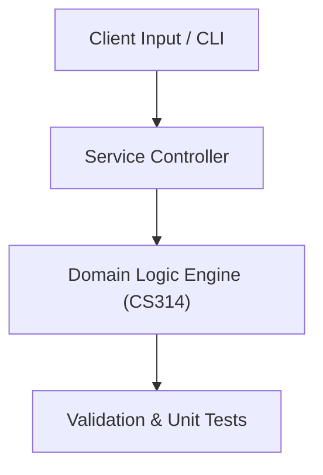

# Project: Automated Data Processing & Web Scraping Pipeline

**Course:** `CS314` Python Programming  
**Demonstrated Concepts:** Python Data Types, List Comprehensions & Dictionaries, Object-Oriented Python & Magic Methods, File Handling, JSON & CSV Processing  
**Primary Tech Stack:** Python 3.10+, Pytest, Pandas, Requests  

---

## 📌 Problem Statement
Translating theoretical principles of python programming into a functional, modular software system.

## 🎯 Requirements
1. **Core Functionality**: Execute domain logic for python data types, list comprehensions & dictionaries and object-oriented python & magic methods.
2. **Modularity & Clean Code**: Adhere to SOLID principles, descriptive naming, and single-responsibility functions.
3. **Verification**: Comprehensive unit test suite verifying standard behavior and edge cases.

## 🏛️ Architecture


## 🚀 Running the Project
```bash
# Execute unit tests
python -m unittest discover tests/
```
