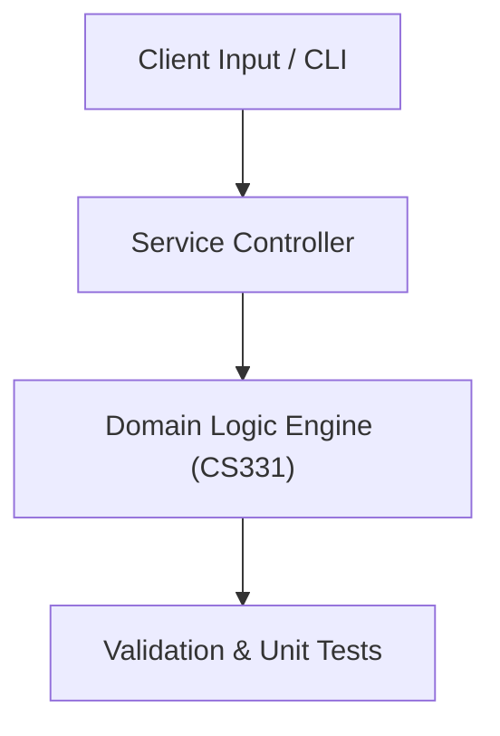

# Project: Concurrent Multi-Client Server Messaging System

**Course:** `CS331` Computer Networks 1  
**Demonstrated Concepts:** OSI 7-Layer & TCP/IP 4-Layer Models, Application Layer: HTTP, DNS, SMTP, FTP, Transport Layer: TCP (Reliable Data Transfer, Congestion Control) & UDP  
**Primary Tech Stack:** Python Sockets, Wireshark, Packet Tracer  

---

## 📌 Problem Statement
Translating theoretical principles of computer networks 1 into a functional, modular software system.

## 🎯 Requirements
1. **Core Functionality**: Execute domain logic for osi 7-layer & tcp/ip 4-layer models and application layer: http, dns, smtp, ftp.
2. **Modularity & Clean Code**: Adhere to SOLID principles, descriptive naming, and single-responsibility functions.
3. **Verification**: Comprehensive unit test suite verifying standard behavior and edge cases.

## 🏛️ Architecture


## 🚀 Running the Project
```bash
# Execute unit tests
python -m unittest discover tests/
```
