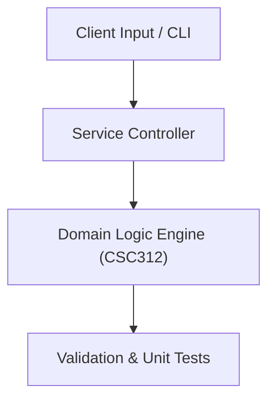

# Project: Two-Pass Assembler & Unix Shell Implementation

**Course:** `CSC312` System Programming  
**Demonstrated Concepts:** Assemblers: Two-Pass Assembler Architecture, Loaders and Linkers: Relocating, Dynamic Linking, Macro Processors: Design & Expansion Algorithms  
**Primary Tech Stack:** C, GCC, Linux POSIX APIs, GDB  

---

## 📌 Problem Statement
Translating theoretical principles of system programming into a functional, modular software system.

## 🎯 Requirements
1. **Core Functionality**: Execute domain logic for assemblers: two-pass assembler architecture and loaders and linkers: relocating, dynamic linking.
2. **Modularity & Clean Code**: Adhere to SOLID principles, descriptive naming, and single-responsibility functions.
3. **Verification**: Comprehensive unit test suite verifying standard behavior and edge cases.

## 🏛️ Architecture


## 🚀 Running the Project
```bash
# Execute unit tests
python -m unittest discover tests/
```
