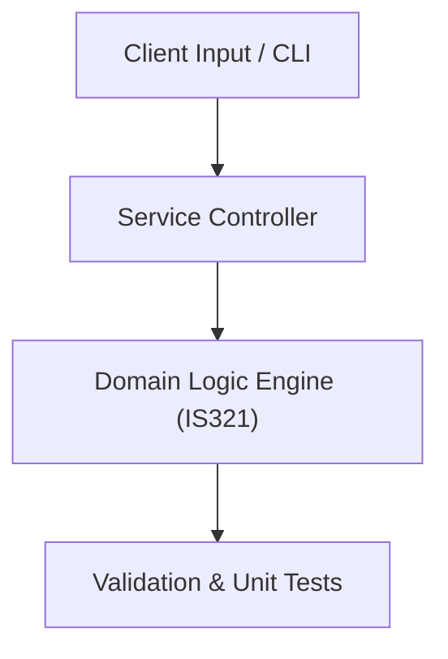

# Project: Software Engineering Project Management Plan & WBS Suite

**Course:** `IS321` Project Management  
**Demonstrated Concepts:** Project Life Cycle & Stakeholder Management, Scope Management & Work Breakdown Structure (WBS), Time Management & Critical Path Method (CPM/PERT)  
**Primary Tech Stack:** Jira, MS Project, Trello, Markdown  

---

## 📌 Problem Statement
Translating theoretical principles of project management into a functional, modular software system.

## 🎯 Requirements
1. **Core Functionality**: Execute domain logic for project life cycle & stakeholder management and scope management & work breakdown structure (wbs).
2. **Modularity & Clean Code**: Adhere to SOLID principles, descriptive naming, and single-responsibility functions.
3. **Verification**: Comprehensive unit test suite verifying standard behavior and edge cases.

## 🏛️ Architecture


## 🚀 Running the Project
```bash
# Execute unit tests
python -m unittest discover tests/
```
