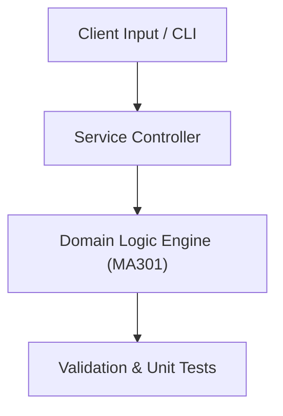

# Project: Linear Programming Simplex Solver & Optimization Toolkit

**Course:** `MA301` Operations Research  
**Demonstrated Concepts:** Mathematical Modeling & Optimization Problems, Linear Programming: Graphical Method, Simplex Algorithm & Two-Phase Method  
**Primary Tech Stack:** Python, PuLP, SciPy Optimize  

---

## 📌 Problem Statement
Translating theoretical principles of operations research into a functional, modular software system.

## 🎯 Requirements
1. **Core Functionality**: Execute domain logic for mathematical modeling & optimization problems and linear programming: graphical method.
2. **Modularity & Clean Code**: Adhere to SOLID principles, descriptive naming, and single-responsibility functions.
3. **Verification**: Comprehensive unit test suite verifying standard behavior and edge cases.

## 🏛️ Architecture


## 🚀 Running the Project
```bash
# Execute unit tests
python -m unittest discover tests/
```
