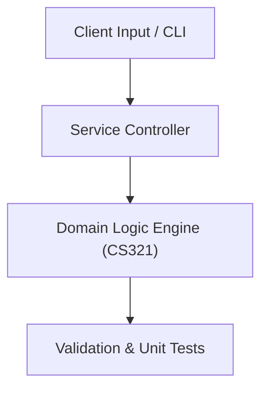

# Project: Process Scheduling & Page Replacement Simulator

**Course:** `CS321` Operating Systems  
**Demonstrated Concepts:** OS Structures, System Calls & Interrupts, Processes, Threads & Multithreading Models, CPU Scheduling (FCFS, SJF, Priority, Round Robin)  
**Primary Tech Stack:** C++, C, POSIX Threads, Linux  

---

## 📌 Problem Statement
Translating theoretical principles of operating systems into a functional, modular software system.

## 🎯 Requirements
1. **Core Functionality**: Execute domain logic for os structures, system calls & interrupts and processes, threads & multithreading models.
2. **Modularity & Clean Code**: Adhere to SOLID principles, descriptive naming, and single-responsibility functions.
3. **Verification**: Comprehensive unit test suite verifying standard behavior and edge cases.

## 🏛️ Architecture


## 🚀 Running the Project
```bash
# Execute unit tests
python -m unittest discover tests/
```
