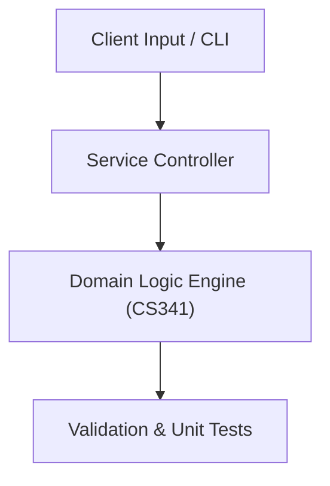

# Project: 2D/3D Rasterization Engine & Transformation Suite

**Course:** `CS341` Computer Graphics  
**Demonstrated Concepts:** Graphics Pipeline & Rasterization, Line Drawing Algorithms (DDA, Bresenham), Circle Generation Algorithms (Midpoint)  
**Primary Tech Stack:** C++, OpenGL / GLUT, GLM, Python  

---

## 📌 Problem Statement
Translating theoretical principles of computer graphics into a functional, modular software system.

## 🎯 Requirements
1. **Core Functionality**: Execute domain logic for graphics pipeline & rasterization and line drawing algorithms (dda, bresenham).
2. **Modularity & Clean Code**: Adhere to SOLID principles, descriptive naming, and single-responsibility functions.
3. **Verification**: Comprehensive unit test suite verifying standard behavior and edge cases.

## 🏛️ Architecture


## 🚀 Running the Project
```bash
# Execute unit tests
python -m unittest discover tests/
```
