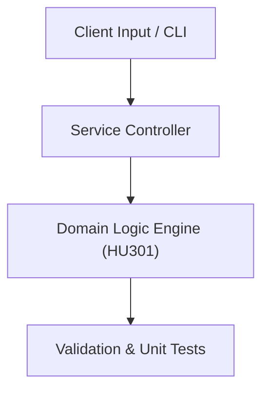

# Project: Standardized Technical Research Report & IEEE Paper Blueprint

**Course:** `HU301` Technical Report Writing  
**Demonstrated Concepts:** Technical Communication Fundamentals, Engineering Report Structure (Abstract, Introduction, Methodology, Results), Data Presentation: Charts, Diagrams, Tables  
**Primary Tech Stack:** LaTeX, Markdown, BibTeX, Pandoc  

---

## 📌 Problem Statement
Translating theoretical principles of technical report writing into a functional, modular software system.

## 🎯 Requirements
1. **Core Functionality**: Execute domain logic for technical communication fundamentals and engineering report structure (abstract, introduction, methodology, results).
2. **Modularity & Clean Code**: Adhere to SOLID principles, descriptive naming, and single-responsibility functions.
3. **Verification**: Comprehensive unit test suite verifying standard behavior and edge cases.

## 🏛️ Architecture


## 🚀 Running the Project
```bash
# Execute unit tests
python -m unittest discover tests/
```
