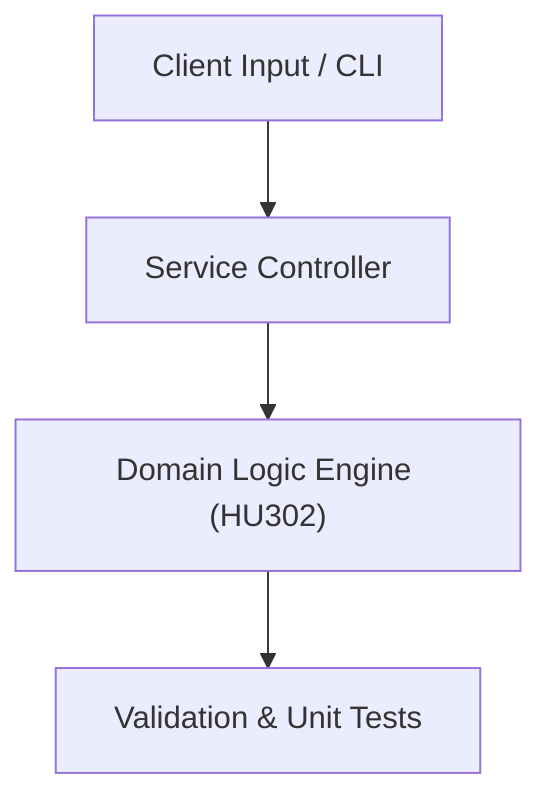

# Project: Tech Startup Go-To-Market & Digital Acquisition Strategy

**Course:** `HU302` Principles of Marketing  
**Demonstrated Concepts:** Marketing Concepts & Customer Value, Market Research & Consumer Behavior, Segmentation, Targeting & Positioning (STP)  
**Primary Tech Stack:** Google Analytics, Marketing Funnels, Markdown  

---

## 📌 Problem Statement
Translating theoretical principles of principles of marketing into a functional, modular software system.

## 🎯 Requirements
1. **Core Functionality**: Execute domain logic for marketing concepts & customer value and market research & consumer behavior.
2. **Modularity & Clean Code**: Adhere to SOLID principles, descriptive naming, and single-responsibility functions.
3. **Verification**: Comprehensive unit test suite verifying standard behavior and edge cases.

## 🏛️ Architecture


## 🚀 Running the Project
```bash
# Execute unit tests
python -m unittest discover tests/
```
