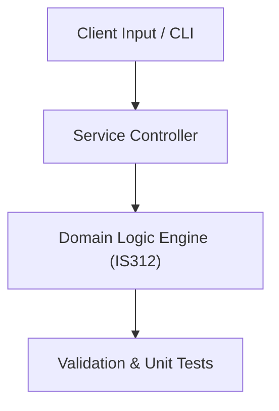

# Project: ACID Transaction & High-Concurrency Banking Database Engine

**Course:** `IS312` Database Systems 2  
**Demonstrated Concepts:** Transaction Processing & ACID Properties, Concurrency Control (Locking, Timestamping, 2PL), Database Recovery Techniques (WAL, Checkpoints)  
**Primary Tech Stack:** PostgreSQL, PL/pgSQL, Redis, MongoDB  

---

## 📌 Problem Statement
Translating theoretical principles of database systems 2 into a functional, modular software system.

## 🎯 Requirements
1. **Core Functionality**: Execute domain logic for transaction processing & acid properties and concurrency control (locking, timestamping, 2pl).
2. **Modularity & Clean Code**: Adhere to SOLID principles, descriptive naming, and single-responsibility functions.
3. **Verification**: Comprehensive unit test suite verifying standard behavior and edge cases.

## 🏛️ Architecture


## 🚀 Running the Project
```bash
# Execute unit tests
python -m unittest discover tests/
```
