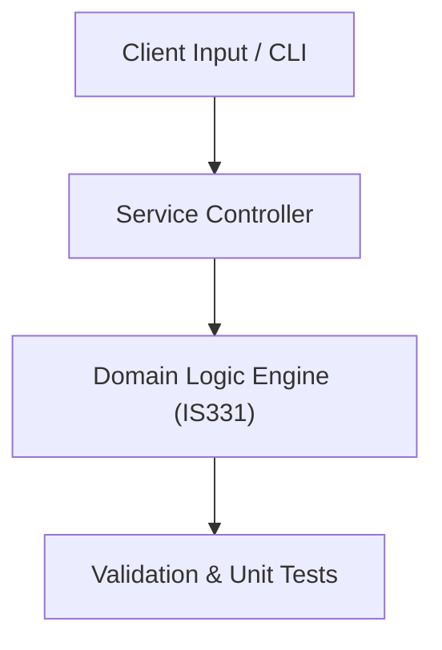

# Project: Enterprise Academic Management System Analysis & UML Blueprint

**Course:** `IS331` System Analysis & Design  
**Demonstrated Concepts:** SDLC Methodologies (Waterfall, Agile, Spiral), Requirements Determination & Use Case Modeling, Data Flow Diagrams (DFD Levels 0, 1, 2)  
**Primary Tech Stack:** PlantUML, Mermaid.js, Draw.io, Markdown  

---

## 📌 Problem Statement
Translating theoretical principles of system analysis & design into a functional, modular software system.

## 🎯 Requirements
1. **Core Functionality**: Execute domain logic for sdlc methodologies (waterfall, agile, spiral) and requirements determination & use case modeling.
2. **Modularity & Clean Code**: Adhere to SOLID principles, descriptive naming, and single-responsibility functions.
3. **Verification**: Comprehensive unit test suite verifying standard behavior and edge cases.

## 🏛️ Architecture


## 🚀 Running the Project
```bash
# Execute unit tests
python -m unittest discover tests/
```
