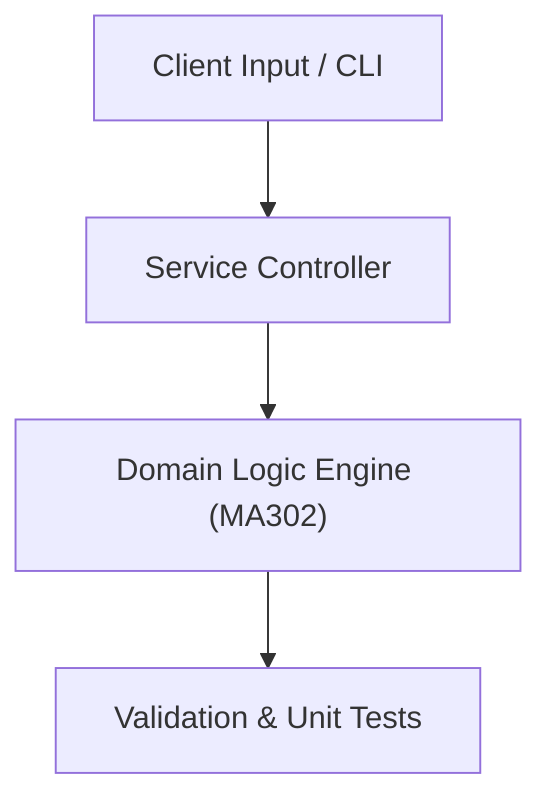

# Project: Differential Equation Numerical Solver (Runge-Kutta & Euler)

**Course:** `MA302` Mathematics 3  
**Demonstrated Concepts:** First-Order Differential Equations (Separable, Exact, Linear), Second-Order Linear Homogeneous & Non-Homogeneous Equations, Laplace Transforms & Applications to Differential Equations  
**Primary Tech Stack:** Python, SciPy, SymPy, NumPy  

---

## 📌 Problem Statement
Translating theoretical principles of mathematics 3 into a functional, modular software system.

## 🎯 Requirements
1. **Core Functionality**: Execute domain logic for first-order differential equations (separable, exact, linear) and second-order linear homogeneous & non-homogeneous equations.
2. **Modularity & Clean Code**: Adhere to SOLID principles, descriptive naming, and single-responsibility functions.
3. **Verification**: Comprehensive unit test suite verifying standard behavior and edge cases.

## 🏛️ Architecture


## 🚀 Running the Project
```bash
# Execute unit tests
python -m unittest discover tests/
```
