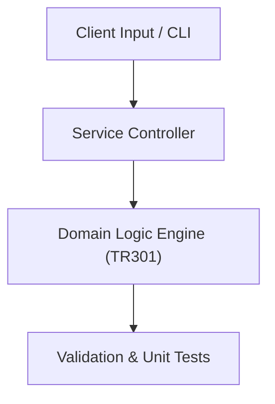

# Project: Automated Financial & Academic Reporting Dashboard

**Course:** `TR301` Microsoft Office Skills Training  
**Demonstrated Concepts:** Advanced Excel (VLOOKUP, INDEX/MATCH, Pivot Tables, Macros), Data Visualization & Dashboard Design, Word for Technical Manuscripts & Automation  
**Primary Tech Stack:** Excel, VBA, Python openpyxl, PowerBI  

---

## 📌 Problem Statement
Translating theoretical principles of microsoft office skills training into a functional, modular software system.

## 🎯 Requirements
1. **Core Functionality**: Execute domain logic for advanced excel (vlookup, index/match, pivot tables, macros) and data visualization & dashboard design.
2. **Modularity & Clean Code**: Adhere to SOLID principles, descriptive naming, and single-responsibility functions.
3. **Verification**: Comprehensive unit test suite verifying standard behavior and edge cases.

## 🏛️ Architecture


## 🚀 Running the Project
```bash
# Execute unit tests
python -m unittest discover tests/
```
