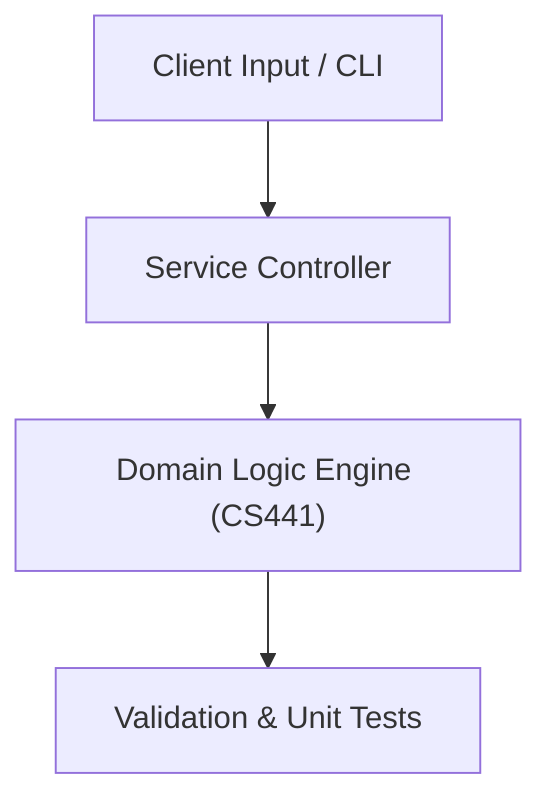

# Project: A* Pathfinding & Minimax Adversarial Game Engine

**Course:** `CS441` Artificial Intelligence  
**Demonstrated Concepts:** Intelligent Agents & Environment Types, Uninformed Search (BFS, DFS, Uniform Cost Search), Informed / Heuristic Search (A*, Greedy Best-First)  
**Primary Tech Stack:** Python 3, Pytest, NumPy  

---

## 📌 Problem Statement
Translating theoretical principles of artificial intelligence into a functional, modular software system.

## 🎯 Requirements
1. **Core Functionality**: Execute domain logic for intelligent agents & environment types and uninformed search (bfs, dfs, uniform cost search).
2. **Modularity & Clean Code**: Adhere to SOLID principles, descriptive naming, and single-responsibility functions.
3. **Verification**: Comprehensive unit test suite verifying standard behavior and edge cases.

## 🏛️ Architecture


## 🚀 Running the Project
```bash
# Execute unit tests
python -m unittest discover tests/
```
