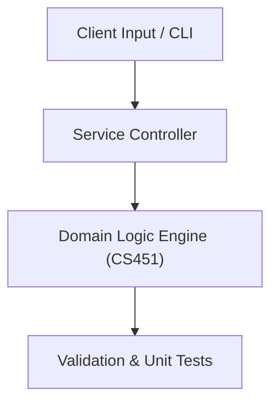

# Project: Cryptographic Suite & Secure Communication Engine

**Course:** `CS451` Information Security  
**Demonstrated Concepts:** Security Principles: Confidentiality, Integrity, Availability (CIA), Classical Ciphers & Cryptanalysis, Symmetric Key Cryptography (DES, 3DES, AES)  
**Primary Tech Stack:** Python, Cryptography library, OpenSSL  

---

## 📌 Problem Statement
Translating theoretical principles of information security into a functional, modular software system.

## 🎯 Requirements
1. **Core Functionality**: Execute domain logic for security principles: confidentiality, integrity, availability (cia) and classical ciphers & cryptanalysis.
2. **Modularity & Clean Code**: Adhere to SOLID principles, descriptive naming, and single-responsibility functions.
3. **Verification**: Comprehensive unit test suite verifying standard behavior and edge cases.

## 🏛️ Architecture


## 🚀 Running the Project
```bash
# Execute unit tests
python -m unittest discover tests/
```
