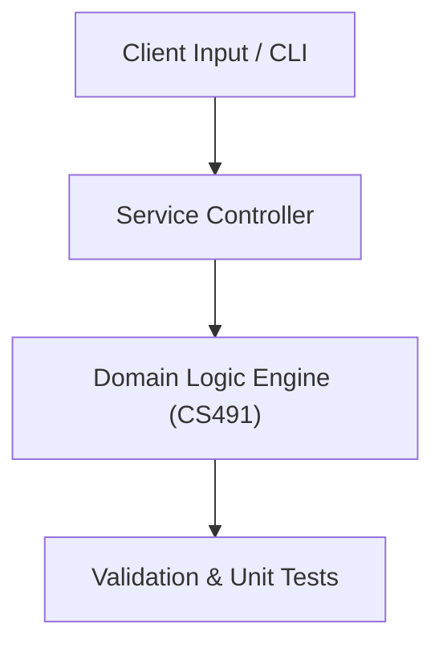

# Project: Containerized Microservices Architecture & CI/CD Pipeline

**Course:** `CS491` Special Topics in Computer Science  
**Demonstrated Concepts:** Cloud Computing Architecture (IaaS, PaaS, SaaS), Microservices Architecture & RESTful APIs, Containerization with Docker & Container Orchestration  
**Primary Tech Stack:** Docker, FastAPI, GitHub Actions, Python  

---

## 📌 Problem Statement
Translating theoretical principles of special topics in computer science into a functional, modular software system.

## 🎯 Requirements
1. **Core Functionality**: Execute domain logic for cloud computing architecture (iaas, paas, saas) and microservices architecture & restful apis.
2. **Modularity & Clean Code**: Adhere to SOLID principles, descriptive naming, and single-responsibility functions.
3. **Verification**: Comprehensive unit test suite verifying standard behavior and edge cases.

## 🏛️ Architecture


## 🚀 Running the Project
```bash
# Execute unit tests
python -m unittest discover tests/
```
