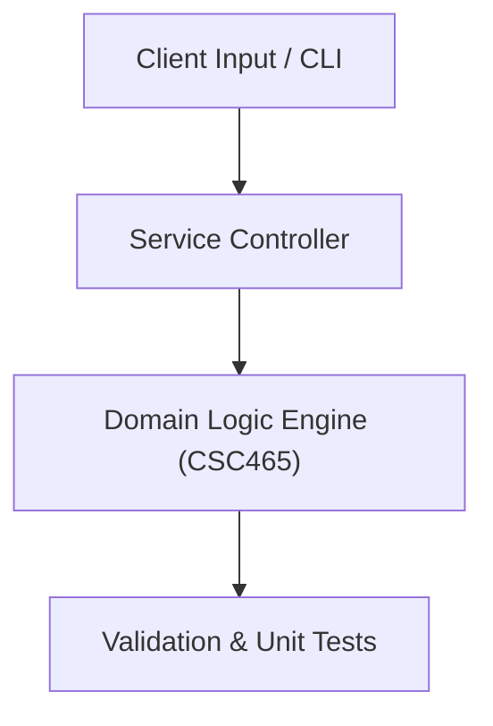

# Project: Production-Grade Academic Service Architecture & TDD Suite

**Course:** `CSC465` Software Engineering  
**Demonstrated Concepts:** Software Processes & Agile Methodologies, Requirements Engineering & IEEE 830 SRS Specification, System Architectural Styles (Layered, Microservices, Event-Driven)  
**Primary Tech Stack:** UML, FastAPI / Python, Pytest, Clean Code Architecture  

---

## 📌 Problem Statement
Translating theoretical principles of software engineering into a functional, modular software system.

## 🎯 Requirements
1. **Core Functionality**: Execute domain logic for software processes & agile methodologies and requirements engineering & ieee 830 srs specification.
2. **Modularity & Clean Code**: Adhere to SOLID principles, descriptive naming, and single-responsibility functions.
3. **Verification**: Comprehensive unit test suite verifying standard behavior and edge cases.

## 🏛️ Architecture


## 🚀 Running the Project
```bash
# Execute unit tests
python -m unittest discover tests/
```
