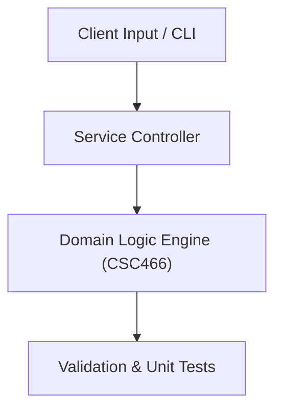

# Project: Apriori Association Rule & K-Means Clustering Mining Pipeline

**Course:** `CSC466` Data Mining  
**Demonstrated Concepts:** Data Mining Process & CRISP-DM Methodology, Data Preprocessing: Cleaning, Integration, Transformation, Reduction, Association Rule Mining & Apriori Algorithm  
**Primary Tech Stack:** Python, Scikit-Learn, Pandas, Matplotlib  

---

## 📌 Problem Statement
Translating theoretical principles of data mining into a functional, modular software system.

## 🎯 Requirements
1. **Core Functionality**: Execute domain logic for data mining process & crisp-dm methodology and data preprocessing: cleaning, integration, transformation, reduction.
2. **Modularity & Clean Code**: Adhere to SOLID principles, descriptive naming, and single-responsibility functions.
3. **Verification**: Comprehensive unit test suite verifying standard behavior and edge cases.

## 🏛️ Architecture


## 🚀 Running the Project
```bash
# Execute unit tests
python -m unittest discover tests/
```
