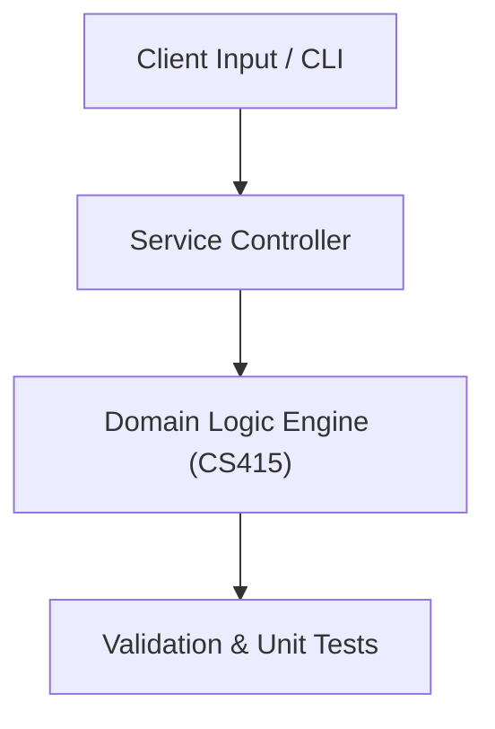

# Project: Cross-Platform Smart Student Course & Schedule App

**Course:** `CS415` Mobile Application Development  
**Demonstrated Concepts:** Mobile Development Paradigms: Native vs Cross-Platform, Dart Programming Language Fundamentals, Flutter Architecture: Widgets, State Management & Reactive UI  
**Primary Tech Stack:** Flutter, Dart, Provider / Bloc, REST APIs  

---

## 📌 Problem Statement
Translating theoretical principles of mobile application development into a functional, modular software system.

## 🎯 Requirements
1. **Core Functionality**: Execute domain logic for mobile development paradigms: native vs cross-platform and dart programming language fundamentals.
2. **Modularity & Clean Code**: Adhere to SOLID principles, descriptive naming, and single-responsibility functions.
3. **Verification**: Comprehensive unit test suite verifying standard behavior and edge cases.

## 🏛️ Architecture


## 🚀 Running the Project
```bash
# Execute unit tests
python -m unittest discover tests/
```
