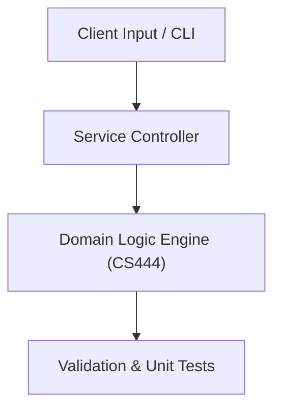

# Project: Computer Vision Image Enhancement & Edge Detection Suite

**Course:** `CS444` Digital Image Processing 1  
**Demonstrated Concepts:** Digital Image Fundamentals & Human Visual Perception, Image Sampling, Quantization & Color Models (RGB, Grayscale, HSV), Intensity Transformations & Histogram Equalization  
**Primary Tech Stack:** Python, OpenCV, NumPy, Matplotlib  

---

## 📌 Problem Statement
Translating theoretical principles of digital image processing 1 into a functional, modular software system.

## 🎯 Requirements
1. **Core Functionality**: Execute domain logic for digital image fundamentals & human visual perception and image sampling, quantization & color models (rgb, grayscale, hsv).
2. **Modularity & Clean Code**: Adhere to SOLID principles, descriptive naming, and single-responsibility functions.
3. **Verification**: Comprehensive unit test suite verifying standard behavior and edge cases.

## 🏛️ Architecture


## 🚀 Running the Project
```bash
# Execute unit tests
python -m unittest discover tests/
```
