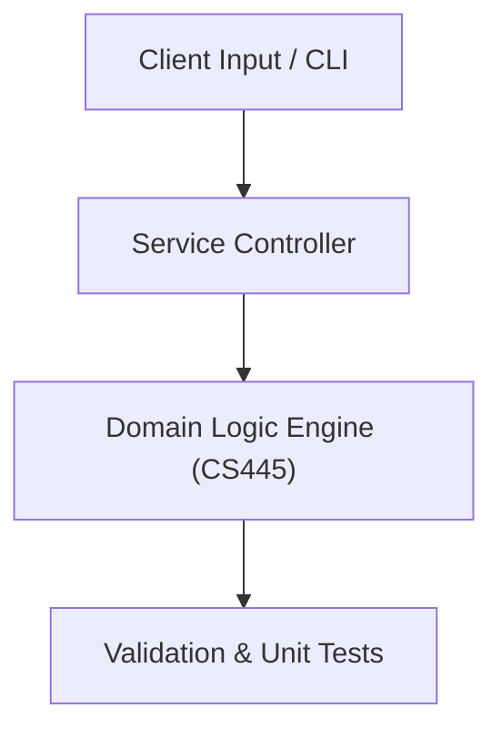

# Project: Fourier Transform Filtering & Otsu Image Segmentation Suite

**Course:** `CS445` Digital Image Processing 2  
**Demonstrated Concepts:** Frequency Domain Filtering & 2D Fast Fourier Transform (FFT), Image Restoration & Noise Models (Gaussian, Salt-and-Pepper), Image Segmentation: Thresholding (Otsu), Region Growing & Watershed  
**Primary Tech Stack:** Python, OpenCV, NumPy, Scikit-Image  

---

## 📌 Problem Statement
Translating theoretical principles of digital image processing 2 into a functional, modular software system.

## 🎯 Requirements
1. **Core Functionality**: Execute domain logic for frequency domain filtering & 2d fast fourier transform (fft) and image restoration & noise models (gaussian, salt-and-pepper).
2. **Modularity & Clean Code**: Adhere to SOLID principles, descriptive naming, and single-responsibility functions.
3. **Verification**: Comprehensive unit test suite verifying standard behavior and edge cases.

## 🏛️ Architecture


## 🚀 Running the Project
```bash
# Execute unit tests
python -m unittest discover tests/
```
