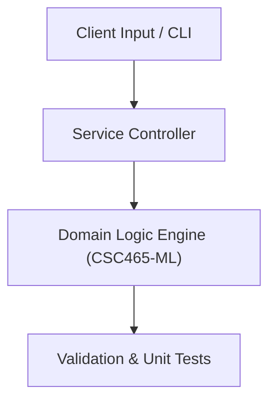

# Project: End-to-End Machine Learning Model Training & Evaluation Pipeline

**Course:** `CSC465-ML` Machine Learning  
**Demonstrated Concepts:** Machine Learning Paradigms: Supervised, Unsupervised, Reinforcement, Linear Regression, Gradient Descent & Regularization (Ridge, Lasso), Logistic Regression & Binary/Multiclass Classification  
**Primary Tech Stack:** Python, Scikit-Learn, PyTorch / TensorFlow, NumPy  

---

## 📌 Problem Statement
Translating theoretical principles of machine learning into a functional, modular software system.

## 🎯 Requirements
1. **Core Functionality**: Execute domain logic for machine learning paradigms: supervised, unsupervised, reinforcement and linear regression, gradient descent & regularization (ridge, lasso).
2. **Modularity & Clean Code**: Adhere to SOLID principles, descriptive naming, and single-responsibility functions.
3. **Verification**: Comprehensive unit test suite verifying standard behavior and edge cases.

## 🏛️ Architecture


## 🚀 Running the Project
```bash
# Execute unit tests
python -m unittest discover tests/
```
