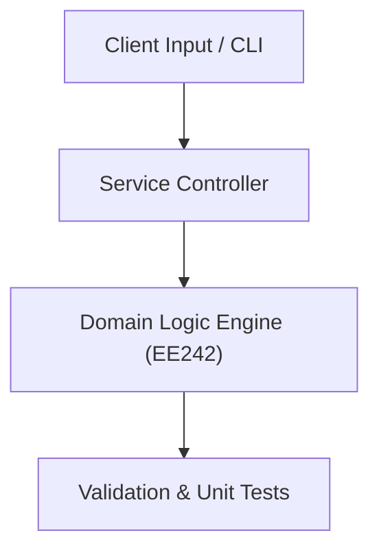

# Project: Quine-McCluskey Boolean Minimizer & Digital Circuit Synthesizer

**Course:** `EE242` Logic Design (Self Study)  
**Demonstrated Concepts:** Advanced Boolean Algebra & Minimization Algorithms (Quine-McCluskey), Design of Complex Sequential Circuits & Registers, Analysis and Design of Asynchronous Sequential Networks  
**Primary Tech Stack:** Verilog, Python Logic Synthesizer, Logisim  

---

## 📌 Problem Statement
Translating theoretical principles of logic design (self study) into a functional, modular software system.

## 🎯 Requirements
1. **Core Functionality**: Execute domain logic for advanced boolean algebra & minimization algorithms (quine-mccluskey) and design of complex sequential circuits & registers.
2. **Modularity & Clean Code**: Adhere to SOLID principles, descriptive naming, and single-responsibility functions.
3. **Verification**: Comprehensive unit test suite verifying standard behavior and edge cases.

## 🏛️ Architecture


## 🚀 Running the Project
```bash
# Execute unit tests
python -m unittest discover tests/
```
