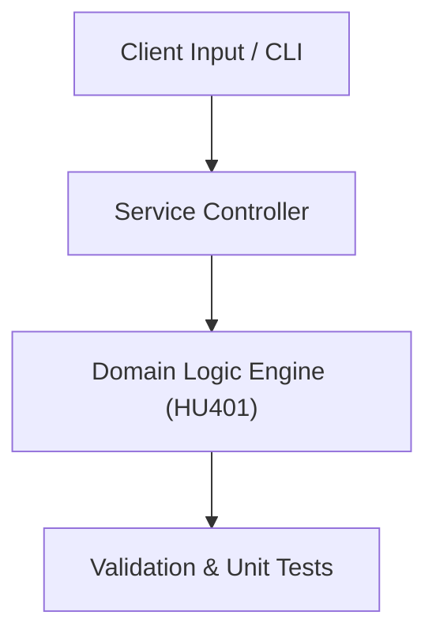

# Project: Design Thinking Innovation Canvas & Product Solution Blueprint

**Course:** `HU401` Creative Thinking & Innovation  
**Demonstrated Concepts:** Creative Thinking Principles & Cognitive Frameworks, Lateral Thinking & Divergent vs Convergent Thinking, Mind Mapping & Systematic Brainstorming (SCAMPER)  
**Primary Tech Stack:** Design Thinking, Brainstorming Frameworks, Markdown  

---

## 📌 Problem Statement
Translating theoretical principles of creative thinking & innovation into a functional, modular software system.

## 🎯 Requirements
1. **Core Functionality**: Execute domain logic for creative thinking principles & cognitive frameworks and lateral thinking & divergent vs convergent thinking.
2. **Modularity & Clean Code**: Adhere to SOLID principles, descriptive naming, and single-responsibility functions.
3. **Verification**: Comprehensive unit test suite verifying standard behavior and edge cases.

## 🏛️ Architecture


## 🚀 Running the Project
```bash
# Execute unit tests
python -m unittest discover tests/
```
