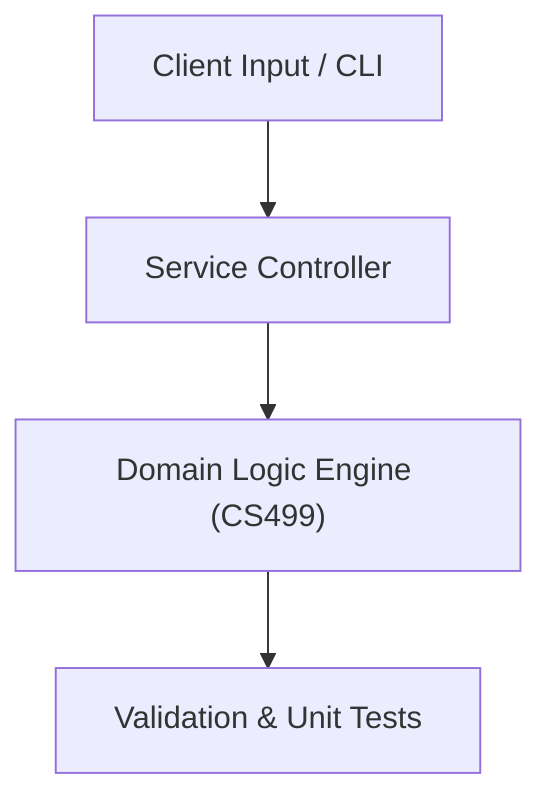

# Project: iLearn: Comprehensive Smart Educational Platform & Management Ecosystem

**Course:** `CS499` Graduation Project  
**Demonstrated Concepts:** iLearn Smart Learning Platform: Full-Stack Architecture, Requirements Engineering (IEEE 830 SRS Specification), Relational Database Design & Schema Architecture  
**Primary Tech Stack:** Flutter, Dart, PHP / Node.js, MySQL / PostgreSQL, Docker, Python AI, REST APIs  

---

## 📌 Problem Statement
Translating theoretical principles of graduation project into a functional, modular software system.

## 🎯 Requirements
1. **Core Functionality**: Execute domain logic for ilearn smart learning platform: full-stack architecture and requirements engineering (ieee 830 srs specification).
2. **Modularity & Clean Code**: Adhere to SOLID principles, descriptive naming, and single-responsibility functions.
3. **Verification**: Comprehensive unit test suite verifying standard behavior and edge cases.

## 🏛️ Architecture


## 🚀 Running the Project
```bash
# Execute unit tests
python -m unittest discover tests/
```
